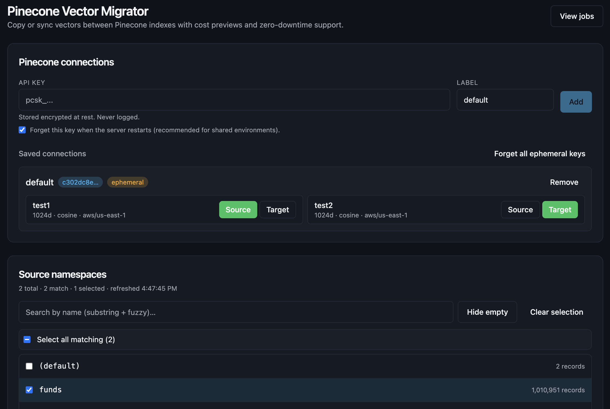
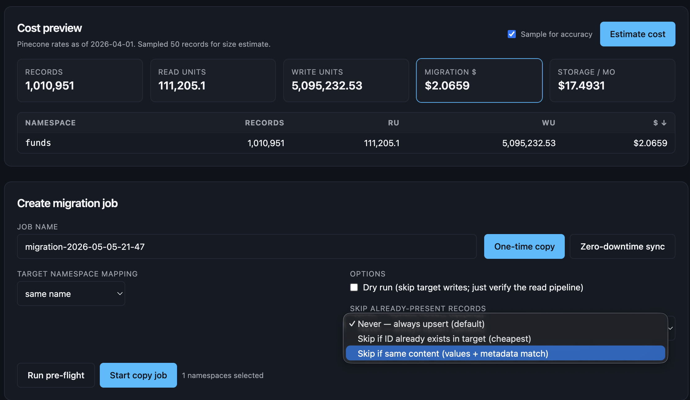
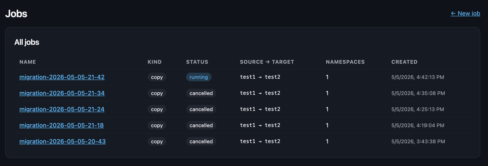
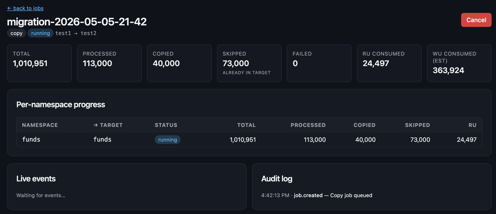
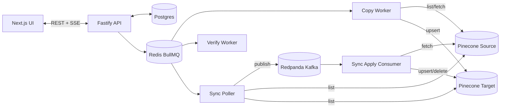

# Pinecone Vector Migrator

A self-hosted web app for copying or syncing vectors between Pinecone indexes and namespaces. It is purpose-built for the very common — and currently painful — task of migrating thousands of namespaces between indexes (e.g. across regions, into a new dimension, or splitting a multi-tenant index).

## Walkthrough

### 1. Connect Pinecone and pick your namespaces

Paste a Pinecone API key (encrypted at rest, ephemeral by default), choose source and target indexes, then browse the namespace list. Fuzzy/substring search filters in real time and the **Select all matching** toggle scales to 100k+ namespaces without breaking a sweat.



### 2. Estimate the cost and configure the job

Sample a few records per namespace to nail down the metadata size, then see RU / WU / dollar estimates per namespace and in total. Pick **One-time copy** or **Zero-downtime sync**, choose how source namespaces map onto target ones, and (optionally) tell the worker to **skip already-present records** by ID or content hash so re-runs don't re-upsert what's already there.



### 3. Track every job from one dashboard

The Jobs page lists every copy and sync, their status, source → target indexes, and namespace counts. Click a row for the detail view.



### 4. Live progress with skip / copy / fail breakdown

The detail view streams updates over SSE and shows totals, processed, copied, **skipped (already in target)**, failed, RU and WU consumed, plus per-namespace progress and an audit trail. For sync jobs, you'll see an additional Sync status card with replication lag, pending ops, and a Promote button for cutover.



## Docker Compose

From the repository root:

```bash
cp .env.example .env
# Edit .env: set MIGRATOR_MASTER_KEY (e.g. openssl rand -base64 32) and any URLs you need.

# Full stack: Postgres, Redis, Redpanda, API, worker, and web (images built from this repo)
docker compose --profile app up --build
```

Then open the web UI at **http://localhost:3000** (API defaults to **http://localhost:4000**). Redpanda Console is on **http://localhost:8080** for inspecting Kafka topics.

**Browser → API in Docker:** the web image is built so the UI calls **`/migrator-api/*` on the same host as the page**; Next.js rewrites those requests to the `api` container. That avoids embedding `http://localhost:4000` in the bundle (which would hit the visitor’s own machine, not your server). Override with build args `NEXT_PUBLIC_API_URL` and `INTERNAL_API_URL` if you need a different layout.

**Infrastructure only** (if you prefer to run API / worker / web with `pnpm` on the host):

```bash
cp .env.example .env
docker compose up -d postgres redis redpanda
```

Use the same `.env` values so `DATABASE_URL`, `REDIS_URL`, and `KAFKA_BROKERS` point at those containers (see [.env.example](.env.example)).

## Highlights

- **Browse and search namespaces at scale.** Server streams the full namespace list (paginated 100 at a time per the Pinecone API). The frontend uses TanStack Virtual + Fuse.js for fuzzy/partial search and remains snappy even at 100k+ namespaces.
- **Master "select-all-matching"** checkbox toggles every namespace currently passing the filter — not just the visible window.
- **Two job modes**:
  - **One-time copy** — resumable `list → fetch → upsert` pipeline with checkpointing, idempotent retries, and concurrency knobs.
  - **Zero-downtime sync** — a polling-based change-data-capture (CDC) approach. The poller diffs source vs target IDs, publishes ops to a Kafka topic, and a separate consumer applies them to the target. Optional metadata-version-field mode detects in-place updates.
- **Cost estimator** driven by the published Pinecone rate card (RU + WU + storage). Sample-based metadata sizing for accuracy. Live re-estimation as you change the selection.
- **Pre-flight checks** for dimension/metric/spec/integrated-embedding mismatches and target namespace mapping conflicts.
- **Verification step** samples N IDs per namespace from both sides and reports mismatches.
- **Cutover UX** for sync jobs: lag indicator, pending-ops gauge, "Promote" button to drain Kafka and retire the poller.
- **Tombstone safety**: if more than X% of target IDs disappear from source in a single pass, the poller pauses and asks for human confirmation.
- **API key handling**: encrypted-at-rest with XChaCha20-Poly1305 keyed via a master HKDF; default ephemeral mode purges keys on server restart.
- **Observability**: Prometheus `/metrics` endpoint, ready-to-use Grafana dashboard ([deploy/grafana/dashboard.json](deploy/grafana/dashboard.json)), and a queryable audit log.
- **CLI parity**: every action is callable from `pinecone-migrator` for scripting and CI.

## Quickstart (local dev with pnpm)

Use this when Postgres / Redis / Redpanda are already running (see **Docker Compose** above). Run all commands from the repository root.

```bash
pnpm install
pnpm build      # one-time so apps/web can load shared/cost-estimator dist

pnpm --filter @migrator/api migrate

pnpm --filter @migrator/api dev      # http://localhost:4000
pnpm --filter @migrator/worker dev   # workers
pnpm --filter @migrator/web dev      # http://localhost:3000
```

Then open <http://localhost:3000>, paste a Pinecone API key, pick a source and target index, and go.

## Architecture



## Repository layout

| Path | What's there |
| --- | --- |
| [`apps/web/`](apps/web/) | Next.js 15 + React 19 frontend, virtualized namespace browser, cost panel, job dashboards |
| [`apps/api/`](apps/api/) | Fastify orchestrator, REST + SSE, Postgres-backed jobs and audit |
| [`apps/worker/`](apps/worker/) | BullMQ workers (copy, verify, sync poller), Kafka consumer (sync apply) |
| [`apps/cli/`](apps/cli/) | `pinecone-migrator` CLI |
| [`packages/pinecone-client/`](packages/pinecone-client/) | Wrapper around `@pinecone-database/pinecone` with rate-limit + retry helpers |
| [`packages/cost-estimator/`](packages/cost-estimator/) | Pure cost math (RU/WU formulas) shared by UI and worker |
| [`packages/shared/`](packages/shared/) | Zod schemas, Kafka topic helpers, types |
| [`config/pricing.json`](config/pricing.json) | Pinecone rate card. Edit here or override in the UI. |
| [`deploy/`](deploy/) | Dockerfiles, Helm chart skeleton, Grafana dashboard |

## CDC strategy

Pinecone has no native event stream. This project uses a **polling diff** approach:

1. Every `pollIntervalMs`, list every ID in source and in target.
2. Compute set differences: new IDs (insert), missing IDs (delete).
3. Publish `UPSERT` / `DELETE` messages to a Kafka topic (`migrator.cdc.<jobId>`).
4. A separate consumer reads the topic and applies ops to the target with the same retry/throttle behavior as the one-time copy.

**Important**: ID-diffing cannot detect a *modify-in-place* (same ID, new vector) by itself. Two opt-in escape hatches:

- **Version-field mode**: nominate a metadata field (e.g. `_v` or `updated_at`). The poller samples IDs that exist on both sides and replicates rows where the source field is greater than the target.
- **Tombstone safety**: if the proportion of target-only IDs jumps by more than the configured threshold in a single pass (default 10%), the poller pauses and waits for a human confirm. This prevents catastrophic mass-deletes from a transient list error.

Why Kafka? It keeps the architecture identical when you later add a producer-side SDK shim (the customer's app teeing every Pinecone write into the same topic) for true real-time CDC, with no rewrites on the consumer side.

## Cost estimator

Formulas mirror [Pinecone's pricing docs](https://docs.pinecone.io/guides/manage-cost/understanding-cost) and are encoded in [`packages/cost-estimator`](packages/cost-estimator/src/index.ts):

- `list` → 1 RU per call (100 IDs/call by default)
- `fetch` → 1 RU per 10 records (1 RU minimum)
- `upsert` → 1 WU per 1 KB (5 WU minimum per request)

The UI samples ~50 records from each selected namespace to learn the average metadata size before pricing the migration. You can disable sampling for a quicker estimate or override the per-record bytes manually.

## CLI examples

```bash
# Register a connection
pinecone-migrator connect --api-key $PINECONE_API_KEY --label prod

# List namespaces
pinecone-migrator namespaces -c <conn-id> -i my-index

# Estimate cost for a list of namespaces
echo -e "tenant-1\ntenant-2\ntenant-3" > ns.txt
pinecone-migrator cost -c <conn-id> -i my-index -n @ns.txt

# Run a copy
pinecone-migrator copy \
  --source-connection <src> --source-index old-index \
  --target-connection <tgt> --target-index new-index \
  -n @ns.txt --mapping prefix --mapping-value migrated-

# Run a sync (zero-downtime)
pinecone-migrator sync \
  --source-connection <src> --source-index old-index \
  --target-connection <tgt> --target-index new-index \
  -n @ns.txt --poll-sec 30 --version-field _v

# Promote (cut over)
pinecone-migrator promote <jobId>
```

## Security model

- API keys are validated against Pinecone before storage and encrypted with XChaCha20-Poly1305 (libsodium-style). The encryption key is derived via HKDF-SHA-256 from `MIGRATOR_MASTER_KEY` (set in `.env`).
- Pino's redaction config strips `apiKey` / `api_key` / `authorization` paths from every log line.
- Default-ephemeral connections are purged on every server restart and via the "Forget all ephemeral keys" UI button.
- The audit log records every connection add/remove, job lifecycle event, sync poll outcome, and verification result.

## Limits Pinecone applies (encoded in the rate limiter)

- 100 RPS upsert / delete / update / query per namespace
- 200 RPS list, 100 RPS fetch, 100 RPS describe-index-stats per index
- 50 MB/s upsert bandwidth per namespace
- 1000 IDs per fetch, 1000 records or 2 MB per upsert request, 100 IDs per list page

The token-bucket rate limiter in [`packages/pinecone-client/src/rate-limit.ts`](packages/pinecone-client/src/rate-limit.ts) enforces these on the client side so we never trigger a 429 storm.

## License

MIT.
